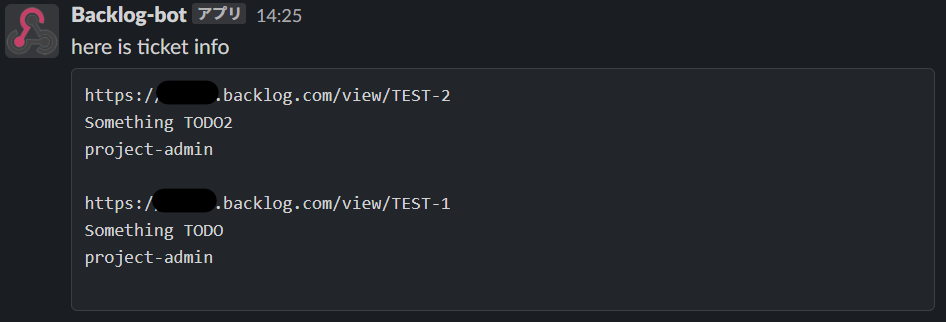

# backlogslackify


backlogslacify makes slack post to announce backlog ticket.

it is depends on [github.com/kenzo0107/backlog](https://github.com/kenzo0107/backlog) to use Backlog API.

## Usage

* please set up the client and call Post()

```main.go
package main

import (
	bls "github.com/maito1201/backlogslackify
	"os"
	"time"
	"github.com/kenzo0107/backlog"
)

func main() {
	condition := []bls.SearchCondition{
		{
			Name: "Ticket Untreated",
			Condition: &backlog.GetIssuesOptions{
            	ProjectIDs: []int{12345},
            	CategoryIDs: []int{12345, 23456},
            	StatusIDs: []int{1},
			},
		},
        {
			Name: "Ticket Doing",
			Condition: &backlog.GetIssuesOptions{
            	ProjectIDs: []int{12345},
            	CategoryIDs: []int{12345, 23456},
            	StatusIDs: []int{2},
			},
		},
        {
			Name: "Ticket Done(Not Completed)",
			Condition: &backlog.GetIssuesOptions{
            	ProjectIDs: []int{12345},
            	CategoryIDs: []int{12345, 23456},
            	StatusIDs: []int{3},
			},
		},
	}
	opts := bls.ClientOption {
		BacklogApiKey: "dummy",
		BacklogBaseUrl: "https://example.backlog.com",
		BacklogDueDate: "weekend",
		SlackWebhookUrl: "https://hooks.slack.com/services/EXAMPLE/EXAMPLE/EXAMPLE",
		SlackChannel: "my-team-backlog",
		SlackAccountName: "Backlog-bot",
		SlackIconEmoji: ":backlog:",
		SlackIconUrl: "",
		IsSinglePost: true,
		DryRun: false,
		SearchConditions: condition,
	}
	client, err := bls.NewClient(opts, time.Now())
	if err != nil {
		log.Fatal(err)
	} 
	if err := client.Post(); err != nil {
		log.Fatal(err)
	}
}
```

* To keep your API keys safe, We recommend using json or something avoiding hard-code.

main.go

```main.go
package main

import (
	bls "github.com/maito1201/backlogslackify
	"encoding/json"
	"os"
	"log"
	"time"
)

func main() {
	config, err := os.ReadFile("./config.json")
	if err != nil {
		log.Fatal(err)
	}
	var opts bls.ClientOption
	if err := json.Unmarshal(config, &opts); err != nil {
		log.Fatal(err)
	}

	client, err := bls.NewClient(opts, time.Now())
	if err != nil {
		log.Fatal(err)
	} 
	if err := client.Post(); err != nil {
		log.Fatal(err)
	}
}
```

config.json

```config.json
{
    "backlog_api_key": "dummy",
    "backlog_base_url": "https://exapmle.backlog.com",
    "backlog_due_date": "end_of_month",
    "slack_webhool_url": "https://hooks.slack.com/services/EXAMPLE/EXAMPLE/EXAMPLE",
    "slack_channel": "my-team-backlog",
    "slack_account_name": "",
    "slack_icon_emoji": "",
    "slack_icon_url": "https://example.com",
    "is_single_post": false,
    "dry_run": true,
    "search_conditions": [
        {
            "name": "here is ticket info",
            "condition": {
                "ProjectIDs": [12345],
                "CategoryIDs": [12345, 23456],
                "StatusIDs": [1, 2, 3]
            }
        }
    ]
}
```

* If the DryRun option is true, the information will not be posted to slack, it will only be displayed to stdout.
